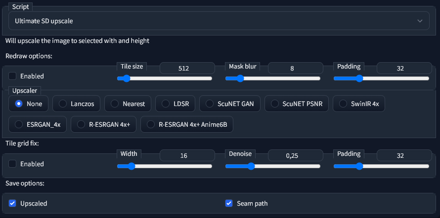

# Ultimate SD upscaler for automatic1111 web-ui
Now you have the opportunity to use a large denoise (0.3-0.5) and not spawn many artifacts. Works on any video card, since you can use a 512x512 tile size and the image will converge.

# How to install
1. Go to "Extensions" tab
2. Select "Install from URL"
3. Put https://github.com/Coyote-A/ultimate-upscale-for-automatic1111 into "URL for extension's git repository" field
4. On "Installed" tab click "Apply and restart UI"
5. ???
6. Profit

# How to use
Send image to img2img, in "Script" field select "Ultimate SD upscale". The width and height of the future image is selected through the default slider.

Enable redraw if it disabled. Select tile size, change padding and mask blur.

Select upscaler. If you don't want to use the upscaler it's ok, but the image will be blurry.

If a tile grid is visible on your image, then you can run the image through "Tile grid fix". Just send it to img2img, enable them and disable redraw. Set upscaler to None.

# Some recommendations

For 4k image use:
* **Tile size**: 768
* **Mask blur**: 20
* **Padding**: 55

For 2k image you can use (you can try it on 4k, but result have many mutations):
* **Tile size**: 512
* **Mask blur**: 16
* **Padding**: 32

Or the same settings as for 4k

Recommended upscaler: R-ESRGAN 4x+

Do not use "Tile grid fix" if image haven't visible grid, it's just another redraw on grids borders.

# How to enable 4096 img width and height
1. Go to sd-webui folder
2. Find ui-config.json
3. Change all 2048 to 4096

# Examples

Original image

2k upscaled. **Tile size**: 512, **Padding**: 32, **Mask blur**: 16

Original image

2k upscaled. **Tile size**: 768, **Padding**: 55, **Mask blur**: 20

4k upscaled. **Tile size**: 768, **Padding**: 55, **Mask blur**: 20

Original image

4k upscaled. **Tile size**: 768, **Padding**: 55, **Mask blur**: 20
